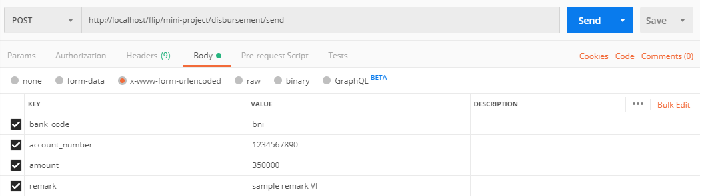
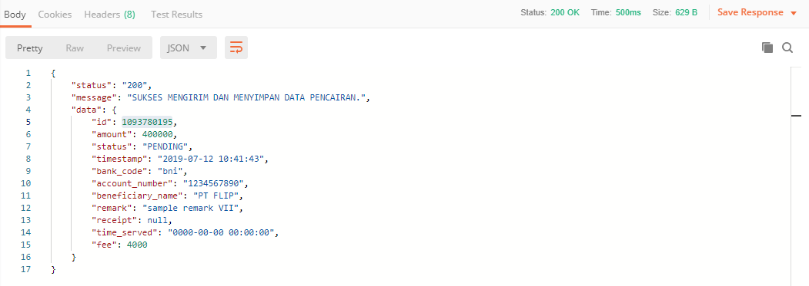
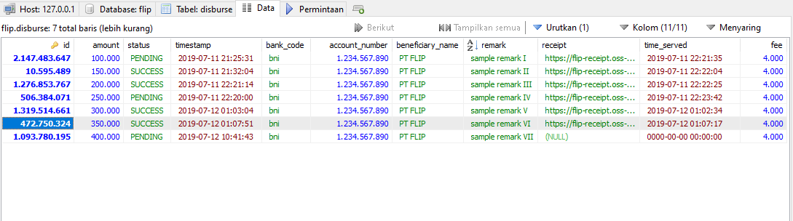
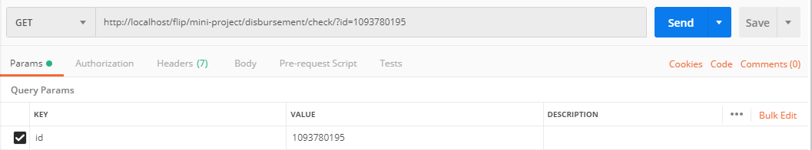
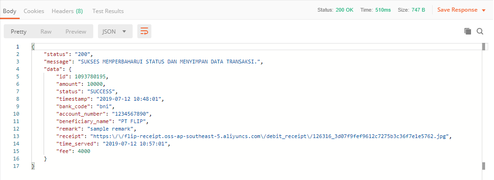
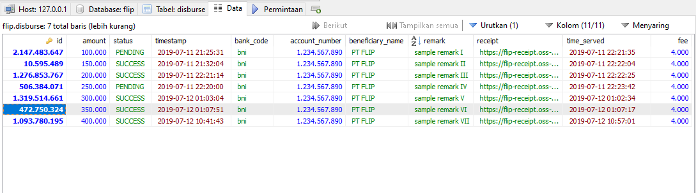

DISBURSEMENT MINI SERVICE WITH SLIGHTLY-BIG FLIP
================

Projek ini bertujuan untuk membuat suatu layanan yang dapat mempermudah kegiatan pengucuran uang. Berikut adalah hal yang dapat dilakukan oleh layanan ini:

* mengirim data pencairan ke API pihak ke-3 (Slightly-big Flip)
* menyimpan data secara rinci mengenai pencairan dari pihak ke-3, ke dalam database
* memeriksa status pencairan berdasarkan id transaksi, dan memperbaharui informasi pada basis data berdasarkan respon yang diterima

## Teknologi, Framework, Tools, Platform ##

Untuk bisa menjalankan layanan ini, ada beberapa software yang harus dipasang, diantaranya:

* XAMPP / LAMPP 7.0.9
* Web Browser (Chrome, Firefox, atau yang lainnya)
* Postman 7.2.2 

## Cara Menjalankan Aplikasi ##

Untuk mengetes layanan ini, bisa langsung [mengunduh kode program dalam format zip](https://github.com/gama9595/disbursement-mini-project/archive/master.zip) atau melakukan `git clone`.

Setelah kode program didapatkan, ekstrak dan taruh di direktori server anda (contoh: htdocs), kemudian buka file `db.php` yang berada di folder config untuk mengatur koneksi database.

Untuk melakukan migrasi database, lakukan hal berikut:

* buatlah database baru, beri nama sesuai dengan yang di-isi di `db.php` sebelumnya. 

* impor file `db.sql` yang ada dalam folder sql ke dalam database tadi, atau jika ingin melakukan migrasi, silahkan buka terminal / command prompt pada folder root kode program, lalu ketik perintah berikut:

        php migration.php

## Testing Layanan dengan Postman ##

* untuk mengirim data pencairan, masukkan alamat url: `[http://alamat-localhost/nama-folder-projek/disbursement/send](http://alamat-localhost/nama-folder-projek/disbursement/send)` dengan metode POST, dan atribut yang di-isi yaitu: `bank_code, account_number, amount, remark`. 

* berikut respon yang didapat setelah sukses mengirim data, sekaligus menyimpan rincian data transaksi berdasarkan hasil respon dari API pihak ke-3 ke dalam database.

* data transaksi berhasil tersimpan ke database.

* untuk mengecek status transaksi, masukkan alamat url: [http://alamat-localhost/nama-folder-projek/disbursement/check/?id=id_transaksi](http://alamat-localhost/nama-folder-projek/disbursement/check/?id=id_transaksi) dengan metode GET, dan parameter yang dipakai adalah `id` dari transaksi yang ada. (contoh: "1093780195").

* berikut respon yang didapat setelah sukses mengecek status data, sekaligus menyimpan hasil respon ke dalam database.

* data transaksi berhasil diperbaharui ke database.

